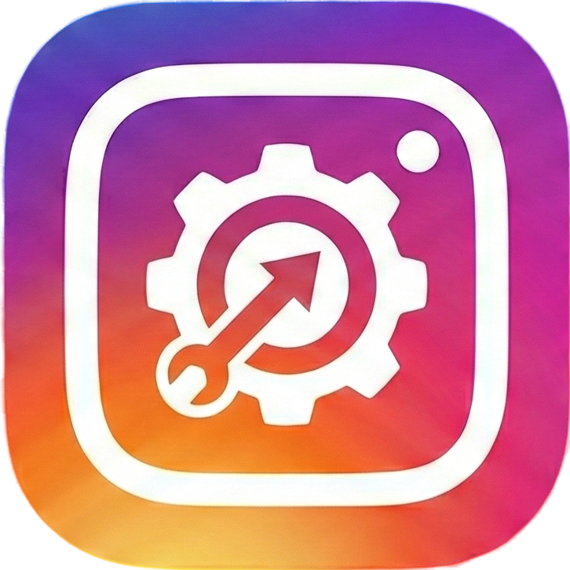

<div align="center">
  
  
  # ToolInsta
  
  ### 🔍 Instagram Data Analyzer — Privacy First, Always
  
  **Transform your Instagram data export into beautiful, organized insights — all processed locally in your browser.**

[](https://nextjs.org/)
[](https://www.typescriptlang.org/)
[](https://tailwindcss.com/)
[](https://web.dev/progressive-web-apps/)
[](LICENSE)

[🚀 **Live Demo**](#) · [📖 **Documentation**](#features) · [🐛 **Report Bug**](https://github.com/aminghafuri/toolinsta/issues) · [✨ **Request Feature**](https://github.com/aminghafuri/toolinsta/issues)

</div>

---

## 📋 Table of Contents

- [About](#-about)
- [Features](#-features)
- [Screenshots](#-screenshots)
- [Getting Started](#-getting-started)
- [How to Use](#-how-to-use)
- [Privacy & Security](#-privacy--security)
- [Contributing](#-contributing)

---

## 🎯 About

**ToolInsta** is a privacy-focused Instagram data analyzer that helps you explore and understand your Instagram data export. Unlike other tools, ToolInsta processes everything **locally in your browser** — your data never leaves your device.

Whether you want to find out who unfollowed you, explore your posts and stories, or understand your digital footprint, ToolInsta provides a beautiful, intuitive interface to navigate your Instagram data.

### Why ToolInsta?

- 🔒 **100% Private**: All processing happens in your browser
- 🚀 **No Server**: Your data is never uploaded anywhere
- 📱 **PWA Support**: Install as a native app on any device
- 🌙 **Dark Mode**: Easy on the eyes, day or night
- 💾 **Offline Ready**: Works without internet after installation

---

## ✨ Features

### 👥 Relationship Analytics

- **Followers & Following Lists** — View complete lists with timestamps
- **Unfollowers Detection** — Find people you follow who don't follow back
- **Mutual Friends** — Discover accounts with reciprocal relationships
- **Not Followed Back** — Identify followers you haven't followed
- **Blocked Profiles** — View accounts you've blocked
- **Pending Requests** — Track follow requests you've sent
- **Recently Unfollowed** — See who you've recently unfollowed
- **Removed Suggestions** — View dismissed account suggestions

### 📊 Personal Information

- **Profile Details** — View username, bio, email, and more
- **Profile Photo** — Display your stored profile picture
- **Account Status** — Private/public account indicator
- **Contact Information** — Phone and email details

### 📍 Location & Interests

- **Locations of Interest** — Places Instagram associates with you
- **Recommended Topics** — Topics Instagram thinks you're interested in
- **Profile Changes History** — Track changes to your profile over time

### 📸 Media Gallery

- **Posts Viewer** — Browse all your posts with full details
- **Stories Archive** — View your archived stories
- **Carousel Support** — Navigate through multi-image posts
- **Video Playback** — Watch your videos directly
- **Sharing Capabilities** — Share media directly from the app

### 🛠️ Additional Features

- **Smart Search** — Quick filtering across all lists
- **Sorting Options** — Sort by name or date
- **Pagination** — Efficient browsing of large datasets
- **Copy to Clipboard** — Quick copy usernames
- **Direct Profile Links** — Open Instagram profiles directly
- **Export/Import Data** — Save and reload your analysis
- **Responsive Design** — Works perfectly on all screen sizes

---

## 📱 Screenshots

<div align="center">
  <table>
    <tr>
      <td align="center" width="50%">
        <br/>
        <strong>Home Page</strong><br/>
        <sub>Beautiful landing with drag & drop upload</sub>
      </td>
      <td align="center" width="50%">
        <br/>
        <strong>Relationship Analytics</strong><br/>
        <sub>Comprehensive follower statistics</sub>
      </td>
    </tr>
    <tr>
      <td align="center" width="50%">
        <br/>
        <strong>Posts & Stories Gallery</strong><br/>
        <sub>Browse your media collection</sub>
      </td>
      <td align="center" width="50%">
        <br/>
        <strong>Personal Information</strong><br/>
        <sub>View your profile details</sub>
      </td>
    </tr>
  </table>
</div>

---

## 🚀 Getting Started

### Prerequisites

- [Node.js](https://nodejs.org/) (v18 or higher)
- [npm](https://www.npmjs.com/), [yarn](https://yarnpkg.com/), or [pnpm](https://pnpm.io/)

### Installation

1. **Clone the repository**

   ```bash
   git clone https://github.com/aminghafuri/toolinsta.git
   cd toolinsta
   ```

2. **Install dependencies**

   ```bash
   npm install
   # or
   yarn install
   # or
   pnpm install
   ```

3. **Run the development server**

   ```bash
   npm run dev
   # or
   yarn dev
   # or
   pnpm dev
   ```

4. **Open your browser**

   Navigate to [http://localhost:3000](http://localhost:3000)

### Building for Production

```bash
npm run build
npm run start
```

---

## 📖 How to Use

### Step 1: Export Your Instagram Data

1. Open Instagram on mobile or web
2. Go to **Settings** → **Accounts Center**
3. Tap **Your information and permissions**
4. Select **Export your information** → **Create export**
5. Choose your account and select **Export to device**
6. Set format to **JSON** (important!)
7. Wait for Instagram to prepare your data (may take up to 30 days)
8. Download the ZIP file from the link in your email

### Step 2: Upload to ToolInsta

1. Open ToolInsta
2. Drag and drop your ZIP file, or click to upload
3. Wait for extraction to complete
4. Explore your data!

### Tips for Faster Exports

- ⚡ Uncheck **Messages** to reduce file size significantly
- 📷 Choose **Lower quality** for media to speed up download
- 📅 Select **All time** for complete data coverage

---

## 🔒 Privacy & Security

### Your Data Stays With You

ToolInsta is designed with privacy as the core principle:

| Aspect          | Implementation                             |
| --------------- | ------------------------------------------ |
| **Processing**  | 100% client-side in your browser           |
| **Storage**     | Data stored in browser's localStorage only |
| **Network**     | No data is ever sent to any server         |
| **Persistence** | Clear data anytime with one click          |
| **Open Source** | Full source code available for audit       |

### No Analytics, No Tracking

- ❌ No cookies for tracking
- ❌ No analytics services
- ❌ No data collection
- ❌ No external API calls with your data
- ✅ Complete transparency

---

## 🤝 Contributing

Contributions are welcome! Here's how you can help:

1. **Fork the repository**
2. **Create a feature branch**
   ```bash
   git checkout -b feature/amazing-feature
   ```
3. **Commit your changes**
   ```bash
   git commit -m 'Add some amazing feature'
   ```
4. **Push to the branch**
   ```bash
   git push origin feature/amazing-feature
   ```
5. **Open a Pull Request**

### Development Guidelines

- Use TypeScript for all new code
- Follow existing code style and conventions
- Write self-documenting code with descriptive naming
- Apply DRY and KISS principles
- Use Tailwind v4 syntax
- Ensure components are responsive

---

<div align="center">
  
  Made with ❤️ by [Amin Ghafuri](https://github.com/aminghafuri)
  
  ⭐ **Star this repo if you find it useful!** ⭐
  
  [🐛 Report Bug](https://github.com/aminghafuri/toolinsta/issues) · [✨ Request Feature](https://github.com/aminghafuri/toolinsta/issues)

</div>
